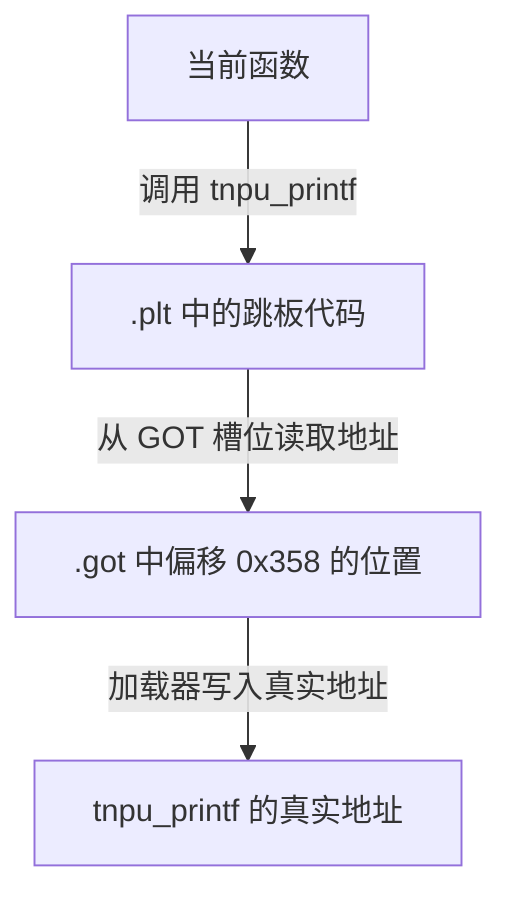
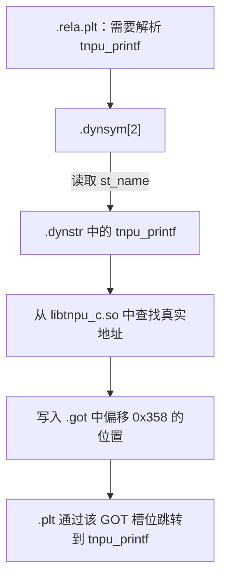
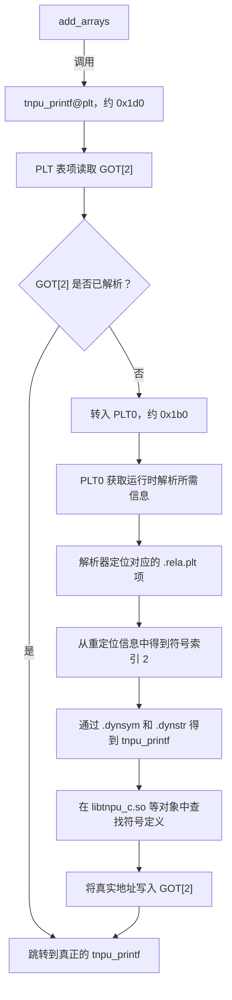
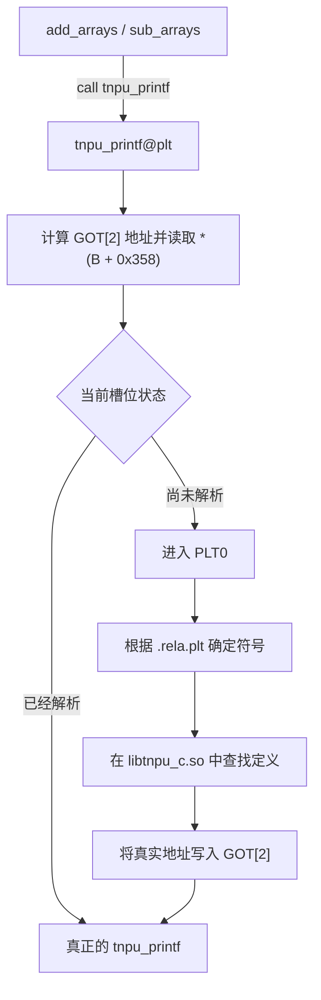

````markdown
## PLT 与 GOT 的调用过程



## 七、为什么不直接修改调用指令

一个很自然的问题是：

> 既然已经找到了 `tnpu_printf` 的真实地址，为什么不直接修改 `.text` 中的 `call` 指令？

主要原因包括：

- `.text` 可以保持只读和可执行，不需要在运行时修改。
- 对同一个外部函数的多个调用可以共用一个 GOT 槽位。
- 共享代码更容易被多个进程共享。
- 可以支持动态链接和延迟绑定。
- 可以减少运行时需要修改的位置。

因此，动态链接通常采用以下方式：

```text
代码调用 PLT → PLT 读取 GOT → 跳转到外部函数
```

而不是在加载时修改 `.text` 中每一条相关的调用指令。

## `.rela.plt`、`.dynsym` 与 `.dynstr` 的关系



“带显式加数”是指 `Elf32_Rela` 结构体中有专门的 `r_addend` 字段。

重定位计算公式为：

```text
S + A
```

其中：

- `S`：符号的实际地址。
- `A`：显式加数，也就是 `r_addend`。
- 在当前例子中，`A = 0`。

`.rela.plt` 是与 PLT 外部函数调用相关的重定位表。它本身不存放跳板代码，而是告诉加载器：

1. 需要解析哪个外部符号；
2. 应该查找哪个动态符号表项；
3. 应该将解析结果写入哪个 GOT 槽位。

真正的跳板代码位于 `.plt` 中。

## `.hash` 节的结构

`.hash` 节采用下面的布局：

```text
┌─────────────────────────┐
│ nbucket                 │ 4 字节
├─────────────────────────┤
│ nchain                  │ 4 字节
├─────────────────────────┤
│ bucket[0]               │
│ bucket[1]               │ 每项 4 字节
│ ...                     │
│ bucket[nbucket - 1]     │
├─────────────────────────┤
│ chain[0]                │
│ chain[1]                │ 每项 4 字节
│ ...                     │
│ chain[nchain - 1]       │
└─────────────────────────┘
```

可以将其理解为下面的 C 语言结构：

```c
uint32_t nbucket;
uint32_t nchain;
uint32_t bucket[nbucket];
uint32_t chain[nchain];
```

其中：

- `nbucket` 表示 bucket 数组中的元素数量。
- `nchain` 表示 chain 数组中的元素数量。
- `nchain` 通常等于所关联的 `.dynsym` 动态符号数量。
- `bucket[]` 保存每条哈希链的起始动态符号索引。
- `chain[]` 保存同一个 bucket 中下一个动态符号的索引。

数值 `0` 在 `.hash` 中有两个相关用途：

```text
bucket[n] = 0  → 这个 bucket 为空
chain[i]  = 0  → 当前哈希链到此结束
```

这两种含义都利用了 `.dynsym[0]` 是保留空符号这一规则。因此，有效的动态符号链不会把索引 `0` 当成普通符号使用。

## GOT 与延迟绑定过程



对应的分步过程为：

1. `add_arrays` 调用 `tnpu_printf@plt`，其地址约为 `0x1d0`。
2. `tnpu_printf@plt` 读取 `GOT[2]`。
3. 如果 `GOT[2]` 已保存真实地址，则直接跳转到 `tnpu_printf`。
4. 如果 `GOT[2]` 尚未解析，则进入 `PLT0`，其地址约为 `0x1b0`。
5. `PLT0` 将控制权交给运行时动态链接器。
6. 动态链接器定位对应的 `.rela.plt` 重定位项。
7. 从重定位项中取得动态符号表索引 `2`。
8. 查询 `.dynsym[2]`，再通过 `st_name` 在 `.dynstr` 中取得符号名 `tnpu_printf`。
9. 在 `libtnpu_c.so` 等参与动态链接的目标文件中查找该符号的定义。
10. 将 `tnpu_printf` 的真实地址写入 `GOT[2]`。
11. 跳转到真正的 `tnpu_printf` 执行。
12. 后续再次调用时，可以直接通过 `GOT[2]` 跳转，不再重复解析。

也可以将“首次调用”和“后续调用”概括为：



> 注意：`GOT[0]`、`GOT[1]` 和 `GOT[2]` 的具体用途可能受到目标架构、ABI、链接器实现以及 PLT/GOT 布局的影响。分析具体 ELF 文件时，应以反汇编结果、重定位表和动态段信息为准。
````
